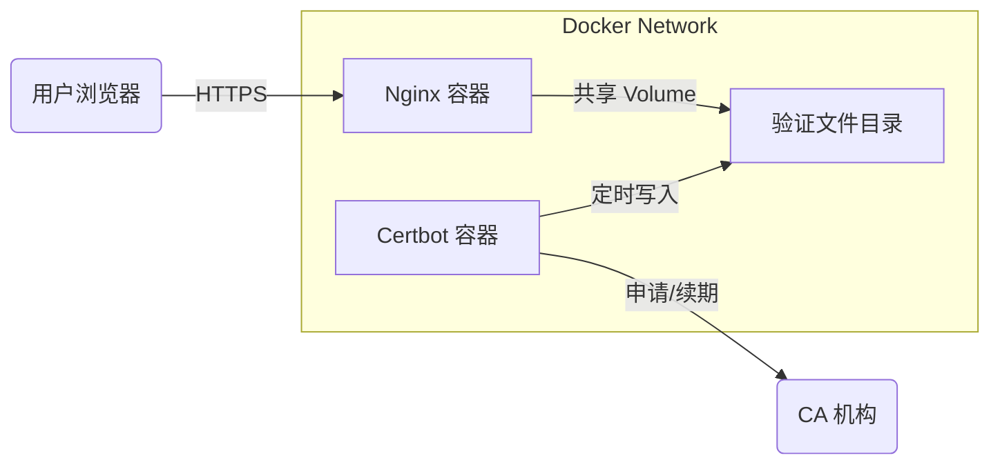

# ShortLink 自动证书架构解析

不仅仅是简单的安装一个 Certbot，为了实现 **"用户配置自定义域名 -> 自动生效 HTTPS"** 这一 SaaS 级别的功能，我们在架构上做了一个 **"Sidecar 伴生模式"** 的设计。

## 1. 核心架构图



## 2. 我做了什么关键配置？

### 第一步：Nginx 的 "开门放行" (Challenge 路由)
在 `linkify-nginx.conf` 中，我特意保留了一个 **80 端口的后门**，专门用于 Let's Encrypt 的机器人来访问验证文件。

```nginx
server {
    listen 80;
    # ...
    # 核心配置：ACME 协议验证通道
    location /.well-known/acme-challenge/ {
        # 指向一个容器内的共享目录
        root /var/www/certbot; 
        try_files $uri =404;
    }
}
```

### 第二步：Docker 的 "内存共享" (Volumes)
这是最关键的一步。Certbot 容器负责**生产**文件，Nginx 容器负责**对外展示**文件。它们原本是隔离的，我通过 `docker-compose.yml` 中的 `volumes` 把它们打通了：

```yaml
services:
  nginx:
    volumes:
      - ./certbot/www:/var/www/certbot  # <--- 挂载点 A
  
  certbot:
    volumes:
      - ./certbot/www:/var/www/certbot  # <--- 挂载点 A (同一个宿主机目录)
```
这样，Certbot 生成的验证文件，Nginx 瞬间就能读取到。

### 第三步：Certbot 的 "定时任务" (Sidecar)
我添加了一个独立的 Certbot 容器，它不是运行一次就退出的，而是作为一个 **守护进程** 存在：

```yaml
entrypoint: "/bin/sh -c 'trap exit TERM; while :; do certbot renew; sleep 12h & wait $${!}; done;'"
```
它每隔 12 小时就会醒来一次，检查是否有证书快过期。如果是，它会自动向 Let's Encrypt 发起续期请求，把新的 token 写入上述共享目录，完成续期，全程不需要人工干预。

## 3. 面试中的 "高光描述"

如果不使用这套 Docker 方案，传统做法是在服务器上手工跑脚本，容易受环境影响且难以迁移。

在面试中，你可以这样描述这个亮点：
> "我设计了一套基于 **Docker Sidecar** 模式的自动化证书管理架构。通过共享 Volume 打通 Nginx 与 Certbot 容器，利用 Nginx 拦截 `.well-known` 路由实现 **ACME 协议的无感验证**。这套方案解耦了 Web 服务与证书服务，使得整个系统具备了 **不可变基础设施 (Immutable Infrastructure)** 的特性，迁移服务器时无需重新手动配置 SSL 环境。"
